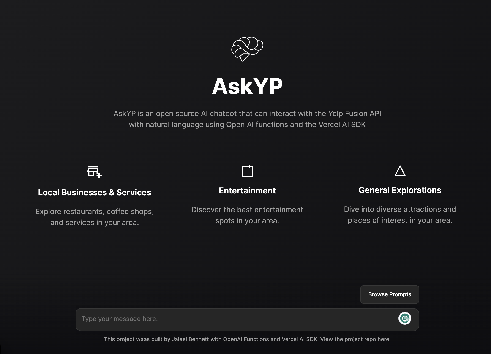

<a href="https://askyp.vercel.app/">
  
  <h1 align="center">AskYP</h1>
</a>

  Chat with Yelp using natural language. Built with OpenAI Functions, Vercel AI SDK and the Yelp Fusion API. 

  
  

  <a href="#introduction"><strong>Introduction</strong></a> ·
  <a href="#setting-up-locally"><strong>Setting Up Locally</strong></a> ·
  <a href="#tech-stack"><strong>Tech Stack</strong></a> ·
  <a href="#contributing"><strong>Contributing</strong></a> ·
  <a href="#license"><strong>License</strong></a>

 

## Introduction

AskYP is an open-source AI chatbot that uses [OpenAI Functions](https://platform.openai.com/docs/guides/gpt/function-calling) and the [Vercel AI SDK](https://sdk.vercel.ai/docs) to interact with the [Yelp Fusion API](https://docs.developer.yelp.com/docs/getting-started) with natural language.

https://github.com/JaleelB/ask-yp/assets/78449846/3ddcb9c1-695b-426a-a80b-dad46630622b

## Setting Up Locally

To set up AskYP locally, you'll need to clone the repository and set up the following environment variables:

- `OPENAI_API_KEY` – your OpenAI API key (you can get one [here](https://platform.openai.com/account/api-keys))
- `IPINFO_TOKEN` - your IPInfo API key (you can get one [here](https://ipinfo.io/account/token))
- `YELP_CLIENT_ID` - your Yelp Fusion API client ID (you can get one [here](https://www.yelp.com/developers/v3/manage_app))
- `YELP_API_KEY` - your Yelp Fusion API key (you can get one [here](https://www.yelp.com/developers/v3/manage_app))
- `KV_URL` - your Vercel KV URL (you can get one [here](https://vercel.com/docs/storage/vercel-kv/quickstart))
- `KV_REST_API_URL` - your Vercel KV API URL (you can get one [here](https://vercel.com/docs/storage/vercel-kv/quickstart))
- `KV_REST_API_TOKEN` - your Vercel KV REST API URL (you can get one [here](https://vercel.com/docs/storage/vercel-kv/quickstart))
- `KV_REST_API_READ_ONLY_TOKEN` - your Vercel KV READ-ONLY REST API URL (you can get one [here](https://vercel.com/docs/storage/vercel-kv/quickstart))

## Tech Stack

AskYP is built on the following stack:

- [Next.js](https://nextjs.org/) – framework
- [OpenAI Functions](https://platform.openai.com/docs/guides/gpt/function-calling) - AI completions
- [Vercel AI SDK](https://sdk.vercel.ai/docs) – AI streaming library
- [Yelp Fusion API](https://docs.developer.yelp.com/docs/getting-started) – API
- [IPInfo](https://ipinfo.io/) – IP geolocation
- [Vercel KV](https://vercel.com/docs/storage/vercel-kv/quickstart) – database
- [Vercel](https://vercel.com) – deployments
- [TailwindCSS](https://tailwindcss.com/) – styles

## Contributing

Here's how you can contribute:

- [Open an issue](https://github.com/JaleelB/ask-yp/issues) if you believe you've encountered a bug.
- Make a [pull request](https://github.com/JaleelB/ask-yp/pulls) to add new features/make quality-of-life improvements/fix bugs.

## Author

- Jaleel Bennett ([@jal_eelll](https://twitter.com/jal_eelll))

## License

Licensed under the [MIT license](https://github.com/JaleelB/ask-yp/blob/main/LICENSE.md).
